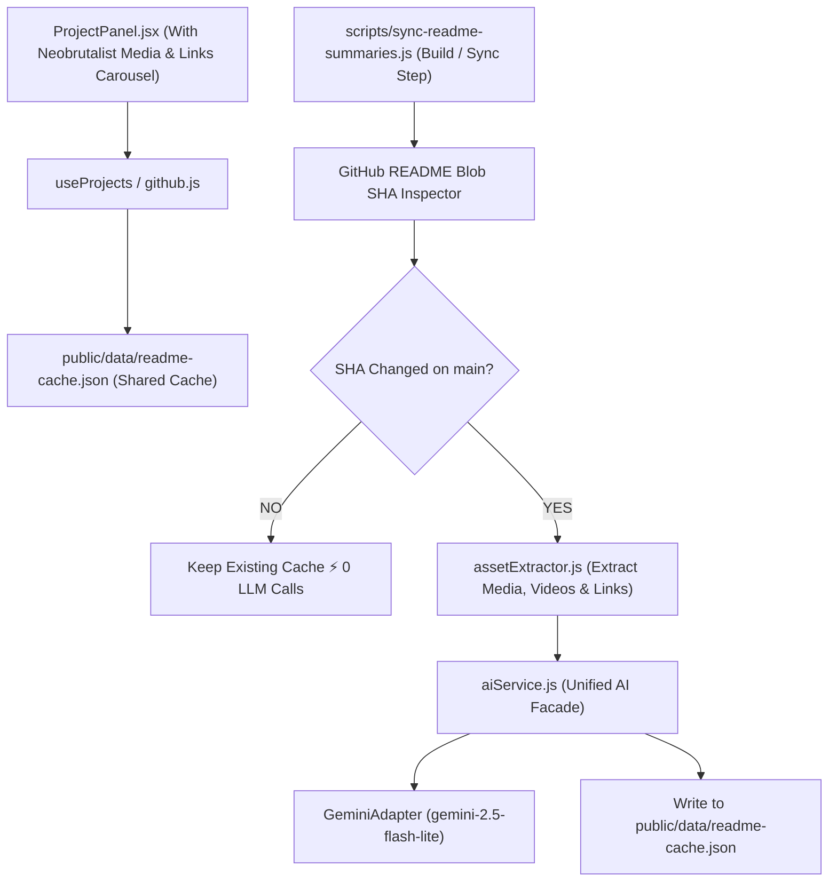

# GitHub README Summarizer Implementation Plan (Shared Cache & Neobrutalist Carousel)

Plan for summarizing GitHub project `README.md` files using a **modular, pluggable AI Service architecture** and strict **Git SHA cache invalidation** while preserving media assets (images, screenshots, GIFs), external links, and video embeds into an interactive **Neobrutalist UI carousel**.

---

## Design System & Aesthetic Directives

> [!IMPORTANT]
> **Strict Neobrutalism Aesthetics Requirement**
> All new UI components (`MediaCarousel.jsx`, summary cards, link pills, video wrappers, and slide navigation controls) **MUST** strictly align with the site's existing **Neobrutalism design system** defined in `src/styles/tokens.css`:
> - **Borders**: `--border: 3px solid #111111` (sharp 3px black borders).
> - **Hard Drop Shadows**: `--shadow-hard: 6px 6px 0 #111111` and `--shadow-hard-sm: 3px 3px 0 #111111` (un-blurred, high-contrast offset shadows).
> - **Palette**: Amber prompt accents (`--c-accent: #ffaa00`), paper background (`--c-bg: #f5e9d0`), surface white (`#ffffff`), and link blue (`--c-accent-2: #2244ff`).
> - **Typography**: Monospace terminal font (`var(--font-mono)`).
> - **Buttons & Tabs**: Sharp corners (`--radius: 0px`), hard click translation animations (`transform: translate(2px, 2px)` on active/hover).

---

## Final Architecture & Core Decisions

1. **Shared Build/Server Cache (`public/data/readme-cache.json`)**:
   - Store cached summaries in a shared static JSON file (`public/data/readme-cache.json`) so **all site visitors share the cache**, minimizing LLM API calls to the absolute minimum.
   - Includes a build/sync script (`scripts/sync-readme-summaries.js`) to check GitHub README SHAs and update the cache whenever `README.md` changes on `main`.

2. **Modular AI Service Layer (`aiService.js`)**:
   - Adapter pattern decoupling UI components from AI providers (Gemini Flash Lite, OpenAI GPT-4o-mini, Anthropic, Mock).

3. **Neobrutalist Media & Resource Carousel (`MediaCarousel.jsx`)**:
   - Replaces the default Open Graph image with a multi-slide interactive carousel featuring:
     - **Image / Screenshot Slides**: Preserved images & GIFs in hard-bordered frames.
     - **Video Player Slides**: Embedded HTML5 `<video>` players (for `.mp4`/`.webm`), YouTube/Vimeo/Loom iframe embeds with terminal window headers.
     - **Resource Links Slide**: Dedicated slide showcasing all preserved documentation, demo, and reference links extracted from the README as neobrutalist button pills.

---

## Component & Service Architecture

---

## Proposed Code Changes

### 1. Modular AI Service Layer

#### [NEW] [aiService.js](file:///c:/Users/wrush/OneDrive%20-%20Arizona%20State%20University/MS%20SE/All%20Resume%20Projects/Projects%20after%20Masters/Portfolio%20Website/rushad-portfolio/src/lib/ai/aiService.js)
- Exposes `generateSummary(prompt, options)`. Instantiates provider based on `CONFIG.ai.provider`.

#### [NEW] [adapters/geminiAdapter.js](file:///c:/Users/wrush/OneDrive%20-%20Arizona%20State%20University/MS%20SE/All%20Resume%20Projects/Projects%20after%20Masters/Portfolio%20Website/rushad-portfolio/src/lib/ai/adapters/geminiAdapter.js)
- Fast, low-cost Gemini API implementation (`gemini-2.5-flash-lite`).

#### [NEW] [adapters/openAIAdapter.js](file:///c:/Users/wrush/OneDrive%20-%20Arizona%20State%20University/MS%20SE/All%20Resume%20Projects/Projects%20after%20Masters/Portfolio%20Website/rushad-portfolio/src/lib/ai/adapters/openAIAdapter.js)
- OpenAI implementation (`gpt-4o-mini`).

#### [NEW] [adapters/mockAdapter.js](file:///c:/Users/wrush/OneDrive%20-%20Arizona%20State%20University/MS%20SE/All%20Resume%20Projects/Projects%20after%20Masters/Portfolio%20Website/rushad-portfolio/src/lib/ai/adapters/mockAdapter.js)
- Mock provider for offline testing and zero-API builds.

---

### 2. Core Extractor & SHA Summarizer Engine

#### [NEW] [assetExtractor.js](file:///c:/Users/wrush/OneDrive%20-%20Arizona%20State%20University/MS%20SE/All%20Resume%20Projects/Projects%20after%20Masters/Portfolio%20Website/rushad-portfolio/src/lib/assetExtractor.js)
- Parses Markdown/HTML.
- Converts relative paths to `raw.githubusercontent.com`.
- Strips shields/badges (`shields.io`, `badge.fury.io`, `codecov.io`).
- Extracts images, embedded video links (YouTube, Loom, HTML5 video), and reference links.

#### [NEW] [readmeSummarizer.js](file:///c:/Users/wrush/OneDrive%20-%20Arizona%20State%20University/MS%20SE/All%20Resume%20Projects/Projects%20after%20Masters/Portfolio%20Website/rushad-portfolio/src/lib/readmeSummarizer.js)
- Combines SHA metadata check, asset extraction, AI text summary, and output formatting.

---

### 3. Server/Build Shared Cache & Sync Script

#### [NEW] [public/data/readme-cache.json](file:///c:/Users/wrush/OneDrive%20-%20Arizona%20State%20University/MS%20SE/All%20Resume%20Projects/Projects%20after%20Masters/Portfolio%20Website/rushad-portfolio/public/data/readme-cache.json)
- Shared JSON cache storing `{ [repoName]: { sha, summary, media, videoLinks, links, updatedAt } }`.

#### [NEW] [scripts/sync-readme-summaries.js](file:///c:/Users/wrush/OneDrive%20-%20Arizona%20State%20University/MS%20SE/All%20Resume%20Projects/Projects%20after%20Masters/Portfolio%20Website/rushad-portfolio/scripts/sync-readme-summaries.js)
- Command-line/build script:
  - Fetches list of repos.
  - Queries README blob `sha` per repo.
  - If SHA matches `readme-cache.json`, skips (**0 LLM calls**).
  - If SHA changed, triggers `readmeSummarizer` and updates `readme-cache.json`.

---

### 4. Neobrutalist UI Carousel Component in `ProjectPanel.jsx`

#### [NEW] [MediaCarousel.jsx](file:///c:/Users/wrush/OneDrive%20-%20Arizona%20State%20University/MS%20SE/All%20Resume%20Projects/Projects%20after%20Masters/Portfolio%20Website/rushad-portfolio/src/components/MediaCarousel.jsx)
- Interactive Neobrutalist carousel component replacing the static Open Graph image:
  - **Neobrutalist Styling**: Hard 3px borders, hard offset box shadows (`var(--shadow-hard-sm)`), sharp corners (`0px` radius), monospace font, CRT amber highlights.
  - **Navigation**: High-contrast Previous/Next `<button>` controls + slide indicator tabs (`[Images (3)]`, `[Videos (1)]`, `[Links (5)]`).
  - **Media Slides**: Renders images/GIFs within a terminal frame.
  - **Video Slides**: Renders HTML5 `<video>` controls or YouTube/Loom iframe embeds.
  - **Links Slide**: Dedicated slide rendering all extracted README links with hover micro-animations and tag labels.

#### [MODIFY] [ProjectPanel.jsx](file:///c:/Users/wrush/OneDrive%20-%20Arizona%20State%20University/MS%20SE/All%20Resume%20Projects/Projects%20after%20Masters/Portfolio%20Website/rushad-portfolio/src/components/ProjectPanel.jsx)
- Renders the AI summary text instead of basic description fallback.
- Replaces static open graph image with `<MediaCarousel />`.

---

## Verification Plan

### Automated & Unit Verification
1. **Sync Script SHA Check**: Run `node scripts/sync-readme-summaries.js`. Verify initial generation updates `public/data/readme-cache.json`. Run script again immediately on unchanged repos, confirm output logs detect matching SHA and perform **0 LLM API calls**.
2. **Modular Provider Test**: Set `provider: 'mock'` in `config.js`, run sync script to test without API keys. Set `provider: 'gemini'`, verify Gemini API adapter works cleanly.
3. **Asset & Link Preservation Test**: Verify relative paths transform to `raw.githubusercontent.com`, CI badges are filtered out, and YouTube/Loom/mp4 links are classified correctly into video slides.

### Manual Verification
1. **Interactive Carousel Test**: Launch Vite dev server (`npm run dev`), select a project tab, verify the carousel renders images, videos, and the links slide with smooth tab controls and sharp neobrutalist borders/shadows.
